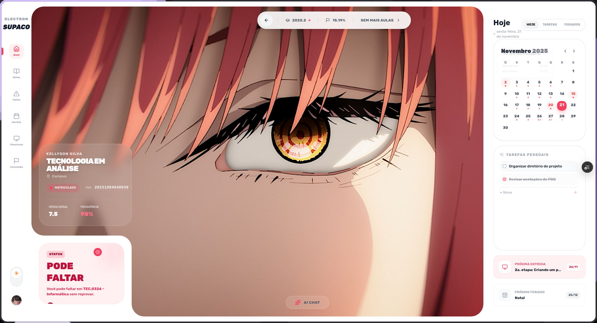
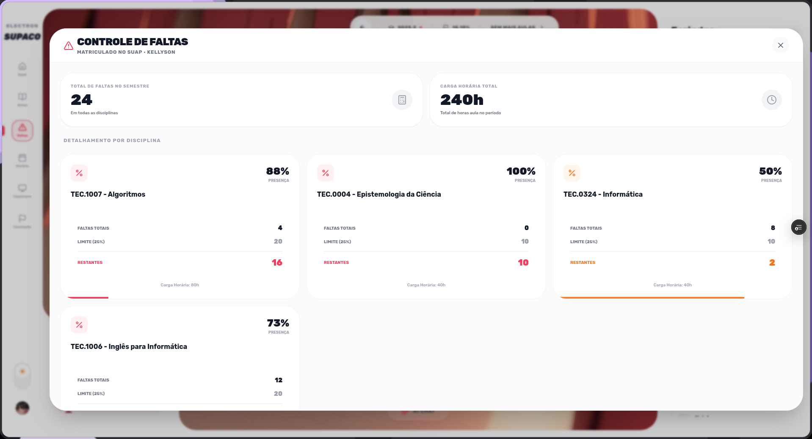
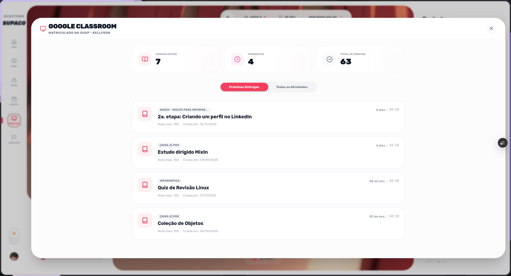

# Supaco

Dashboard acadêmico para estudantes do IFRN com integração ao SUAP e Google Sala de Aula.

## Sobre

O Supaco é uma aplicação que centraliza informações acadêmicas do SUAP (Sistema Unificado de Administração Pública) e do Google Sala de Aula em uma interface moderna e intuitiva. Disponível como aplicação web e desktop.

**Versão Web**: [https://supaco.vercel.app/](https://supaco.vercel.app/)

## Funcionalidades

- **Dashboard Personalizado**: Visualização consolidada de informações acadêmicas
- **Integração com SUAP**: Acesso direto a notas, frequência, horários e dados do perfil
- **Integração com Google Sala de Aula**: Visualização de tarefas e eventos do calendário
- **Análise de Frequência**: Monitoramento de faltas e limites por disciplina
- **Assistente IA com Contexto**: Chat integrado que utiliza seus dados acadêmicos para responder perguntas personalizadas
- **Temas Personalizáveis**: Suporte a modo claro/escuro e múltiplos temas

## Assistente IA

O assistente utiliza a API do Google Gemini e possui acesso ao contexto completo dos seus dados acadêmicos, incluindo:

- Notas e médias por disciplina
- Horários de aula e localização
- Frequência e faltas
- Tarefas e eventos do Google Sala de Aula
- Feriados e calendário acadêmico

**Importante**: Para utilizar o assistente IA, é necessário configurar sua própria chave da API do Google Gemini.

## Screenshots

### Dashboard Principal



### Análise de Frequência



### Integração com Google Sala de Aula



### Assistente IA


## Tecnologias

- **Frontend**: React 19, TypeScript, Vite
- **Desktop**: Electron 39
- **UI**: Tailwind CSS, Framer Motion
- **Gráficos**: Recharts
- **IA**: Google Gemini API

## Instalação

### Pré-requisitos

- Node.js 18+ e npm
- Conta no SUAP do IFRN
- Chave da API do Google Gemini (opcional, para o assistente IA)

### Instalação Local

```bash
git clone https://github.com/seu-usuario/supaco-react.git
cd supaco-react
npm install
```

### Configuração da API Gemini

Crie um arquivo `.env.local` na raiz do projeto:

```bash
GEMINI_API_KEY=sua-chave-aqui
```

## Uso

### Desenvolvimento (Web)

```bash
npm run dev
```

Acesse `http://localhost:5173` no navegador.

### Desenvolvimento (Electron)

```bash
npm run electron:dev
```

### Build de Produção

```bash
npm run build
npm run electron:start
```

## Gerar Executáveis

### Linux (AppImage)

```bash
npm run dist:appimage
```

O arquivo será gerado em `release/Supaco-*.AppImage`

### Windows (EXE)

Para gerar builds Windows no Linux, é necessário instalar Wine:

```bash
sudo apt-get install wine
npm run dist:win
```

O instalador será gerado em `release/`

### Todos os Formatos

```bash
npm run dist:all
```

## Estrutura do Projeto

```
supaco-react/
├── components/
│   ├── DashboardLayout.tsx
│   ├── AIChatWidget.tsx
│   └── InvertedCorner.tsx
├── electron/
│   ├── main.js
│   └── preload.js
├── assets_readme/
│   ├── home.png
│   ├── faltas.png
│   ├── classroom.png
│   └── ia-chat.png
├── App.tsx
├── types.ts
├── vite.config.ts
└── package.json
```

## Scripts Disponíveis

| Script | Descrição |
|--------|-----------|
| `npm run dev` | Inicia servidor de desenvolvimento |
| `npm run build` | Gera build de produção |
| `npm run electron:dev` | Executa Electron em modo desenvolvimento |
| `npm run electron:start` | Executa Electron após build |
| `npm run dist:appimage` | Gera AppImage para Linux |
| `npm run dist:win` | Gera executável para Windows |
| `npm run dist:all` | Gera todos os formatos |

## Segurança

- Context Isolation habilitado
- Node Integration desabilitado
- Comunicação segura com APIs
- Tokens armazenados localmente

## Licença

Este projeto está sob a licença MIT.

## Contribuindo

Contribuições são bem-vindas. Para contribuir:

1. Faça um Fork do projeto
2. Crie uma branch para sua feature (`git checkout -b feature/nova-feature`)
3. Commit suas mudanças (`git commit -m 'Adiciona nova feature'`)
4. Push para a branch (`git push origin feature/nova-feature`)
5. Abra um Pull Request

---

**Desenvolvido para estudantes do IFRN**
